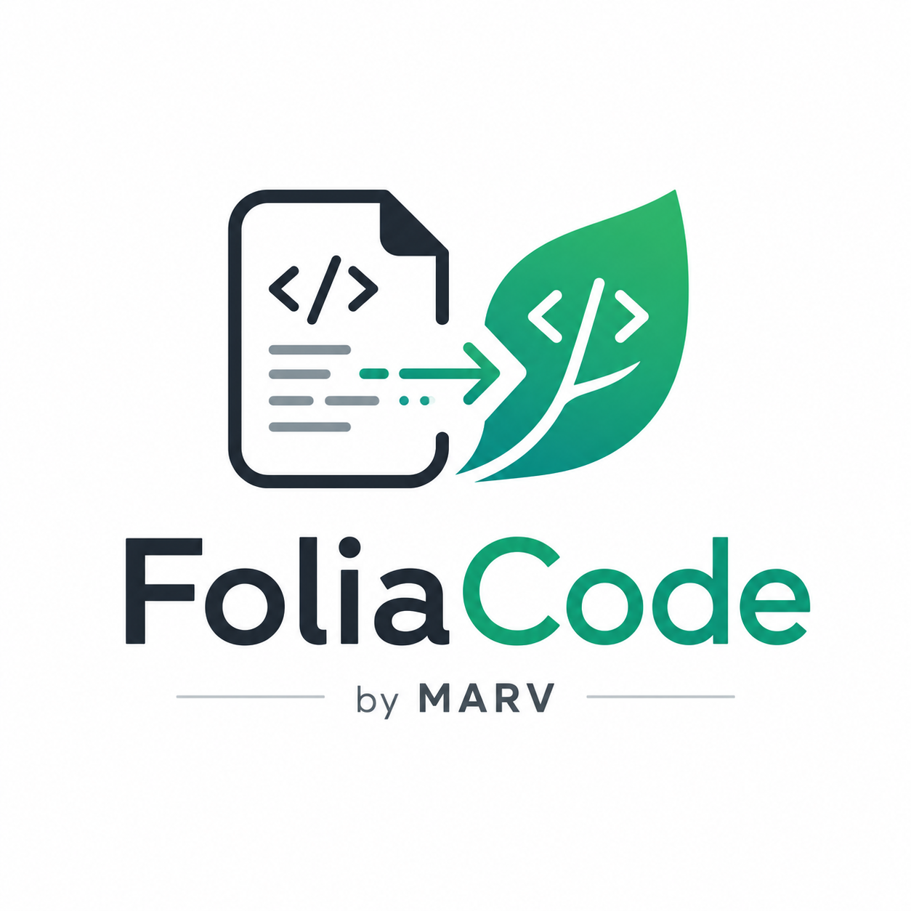

<div align="center">



**Folia compatibility analyzer for Bukkit plugins**

Find out what breaks on [Folia](https://github.com/PaperMC/Folia) — with the exact
call site, why it breaks, and what to do instead.

[](https://github.com/MARVserver/Foliacode/actions/workflows/ci.yml)
[](LICENSE)
[](https://adoptium.net/)

Part of the [MARV](https://github.com/MARVserver) ecosystem · built for the
[PaperMC](https://papermc.io/) / Folia ecosystem

</div>

---

```
$ foliacode analyze EssentialsX-2.22.0.jar

Verdict: NOT READY — this will definitely misbehave on Folia

Findings by severity
  CRITICAL     7  — throws on Folia; will certainly not work
  HIGH        60  — thread-safety violation; risks crashes or data corruption
  MEDIUM      28  — depends on the calling thread context
  INFO       131  — informational; static analysis cannot decide

● BukkitRunnable.runTaskTimer  [Scheduler]  1 call site
  Why:  Folia does not support the synchronous Bukkit scheduler; calling it
        throws UnsupportedOperationException.
  Fix:  Move to GlobalRegionScheduler, RegionScheduler or EntityScheduler.
    - com.earth2me.essentials.commands.essentials.NyanCommand#run (line 32)
      [via NyanCommand$TuneRunnable]
```

2,149 classes in 0.4 seconds. No server required.

---

## Why another one of these

**Diagnosis first, and rewriting only where it can be justified.**

Automatic bytecode patchers are seductive and dangerous: when the patch is wrong,
nothing says so. You get a JAR that loads and then misbehaves in production. A tool
that reports "I cannot safely convert this" is more useful than one that quietly
produces something broken.

FoliaCode does rewrite — but only a handful of call sites, each with a precondition
it checks in the bytecode, and it re-reads its own output to confirm the result.
Everything else is refused *with the reason*, which is the part most such tools leave
out. See [Transform](#transform).

So the order is deliberate:

1. **Diagnose** — say what breaks, where, and why, with evidence.
2. **Verify** — boot a real Folia server and watch the plugin load.
3. **Instrument** — a runtime agent for what static analysis cannot see.
4. **Transform** — rewrite only what can be proven safe.

All four are available. The fourth arrived last on purpose: it is only trustworthy
because the first three can check its work.

---

## What it catches that name-matching misses

### Calls through a subtype

In bytecode, a call site's owner is the **compile-time type**. Matching owner names
exactly misses every call made through a subclass. From real EssentialsX 2.22.0:

```
invokevirtual  com/earth2me/essentials/.../NyanCommand$TuneRunnable.runTaskTimer:(...)
                                           ^^^^^^^^^^^^^^^^^^^^^^^^
                                           the owner is not BukkitRunnable
```

`TuneRunnable extends BukkitRunnable`, so this is a CRITICAL Folia incompatibility
sitting in a top-tier plugin. FoliaCode resolves it by walking both a built-in
Bukkit type hierarchy and the hierarchy it learns from the JAR being analysed.

### Method references

```java
blocks.forEach(Block::breakNaturally);   // no call instruction exists for this
```

A method reference lives in the `invokedynamic` bootstrap arguments as a `Handle`,
not in the instruction stream. Scanning instructions alone misses it — and modern
plugins are full of lambdas.

### Nested JARs

Shaded plugins ship their dependencies as JARs inside the JAR. Skipping those
produces a confident, wrong "nothing found". FoliaCode unpacks one level deep.

---

## Install

Requires Java 21+.

Download the runnable JAR from [Releases](https://github.com/MARVserver/Foliacode/releases),
check it against the published `SHA256SUMS`, and give it a name you can type:

```bash
alias foliacode='java -jar /path/to/foliacode-0.1.0.jar'
```

Or build it yourself:

```bash
git clone https://github.com/MARVserver/Foliacode.git
cd Foliacode
./gradlew :foliacode-cli:fatJar
```

The runnable JAR lands in `foliacode-cli/build/libs/`.

### As a library

The modules are published to GitHub Packages. `foliacode-core` is the analysis
engine; the others are only needed if you want the server sandbox, the runtime
agent, or the rewriter.

```kotlin
repositories {
    maven("https://maven.pkg.github.com/MARVserver/Foliacode") {
        credentials {
            username = providers.gradleProperty("gpr.user").orNull
            password = providers.gradleProperty("gpr.token").orNull
        }
    }
}

dependencies {
    implementation("dev.marv.foliacode:foliacode-core:0.1.0")
}
```

GitHub Packages requires authentication even for public packages, so a token with
`read:packages` is needed either way.

---

## Usage

### Static analysis

Safe, offline, no side effects.

```bash
foliacode analyze MyPlugin.jar              # one plugin
foliacode analyze plugins/                  # every JAR in a directory
foliacode analyze MyPlugin.jar --verbose    # every call site, not just the first few
foliacode analyze plugins/ --json out.json  # machine-readable
foliacode rules                             # show the rule set
```

| Option | Meaning |
|---|---|
| `--json <file>` | Write the result as JSON |
| `--fail-on <severity>` | Exit 1 at or above this severity (default `CRITICAL`) |
| `--verbose` | List every call site instead of truncating |

### Real server verification

Boots an actual Folia server in a throwaway sandbox, watches your plugin load, then
shuts it down and deletes everything.

```bash
foliacode verify MyPlugin.jar --yes --memory 2048
foliacode verify MyPlugin.jar --yes --with Vault.jar --with ProtocolLib.jar
```

This catches what bytecode cannot show you:

- **a dependency plugin that simply is not installed** — reported by name
- a class compiled for a newer Java release than the server runs
- a plugin that throws the moment it is enabled
- Folia refusing to load it at all

| Option | Meaning |
|---|---|
| `--yes` | Consent to downloading and running a Folia server |
| `--mc-version <ver>` | Minecraft version (default `1.21.4`) |
| `--memory <MB>` | Server heap (default `1024`) |
| `--timeout <sec>` | How long to wait for boot (default `180`) |
| `--with <jar>` | Install a dependency plugin alongside; repeatable |
| `--keep-server` | Keep the sandbox directory for inspection |

**It is opt-in on purpose.** It downloads and executes third-party code, so it never
runs unless you pass `--yes` or set `enabled: true` in `foliacode.yml`. The server
jar is checksum-verified against PaperMC's published SHA-256 before it is executed,
and the sandbox is deleted afterwards even if the run is interrupted.

#### On memory

A Folia server **cannot start below about 1024 MB**. It dies with an
`OutOfMemoryError` while Paperclip is still unpacking the server jar — long before
your plugin is ever touched. 2048 MB is realistic.

When that happens FoliaCode reports `OUT_OF_MEMORY` and exits **3**, not 1, and says
plainly that this is a server setting rather than a plugin defect. Misattributing an
out-of-memory server to the plugin would be the worst thing this tool could do.

### Runtime instrumentation

Static analysis lists the calls that *could* break. The agent records which of them
actually ran, how often, and whether the server considered that thread a tick thread.

Easiest route — let `verify` do it inside the throwaway server:

```bash
foliacode verify MyPlugin.jar --yes --instrument
```

Or attach it to a server you run yourself:

```bash
foliacode agent MyPlugin.jar     # prints the exact -javaagent line to paste
```

The gap between the two reports is where the useful information lives:

- a `CRITICAL` finding on a path nothing ever calls is not your first problem
- an `INFO` finding behind reflection that turns out to run every tick is

The agent only counts. It never blocks a call, changes a result, or throws into
plugin code — an observer that alters what it observes is worthless. Reports are
written at JVM shutdown, so stop the server cleanly.

It **cannot** tell you whether a call ran on the correct *region's* thread. Folia
owns entities and chunks per region, and a call can be on a tick thread and still be
on the wrong one.

### Transform

Rewrites the call sites that can be rewritten, and reports the ones that cannot.

```bash
foliacode transform MyPlugin.jar --dry-run     # see what would change
foliacode transform MyPlugin.jar               # writes MyPlugin-folia.jar
```

The original JAR is never modified — the output is a new file beside it.

**The refusals are the point.** The rewrite list is short by design:

| Rewritten | Into |
|---|---|
| `BukkitScheduler.runTask` / `runTaskLater` / `runTaskTimer` | `GlobalRegionScheduler` |
| `BukkitScheduler.scheduleSyncDelayedTask` / `scheduleSyncRepeatingTask` | `GlobalRegionScheduler` |
| `BukkitScheduler.runTaskAsynchronously` | `AsyncScheduler` |
| `Entity.teleport(Location)` | `teleportAsync(Location)` |

and every one of them requires the call's **result to be discarded**, proved from the
`pop` instruction that follows it. The Folia schedulers hand out no `BukkitTask` and
`teleportAsync` has not finished when it returns, so where the result is used the
rewrite would change what the code means. Those sites are refused, with the reason.

`BukkitRunnable` is refused outright. `new BukkitRunnable(){...}.runTaskTimer(...)`
looks like the same job, but a `BukkitRunnable` remembers the task Bukkit gave it so
that `cancel()` works. A task handed to a Folia scheduler never gets one. Proving no
later `cancel()` exists means escape analysis, and getting that subtly wrong produces
a plugin that runs and then misbehaves — the exact outcome this tool exists to prevent.

Block, world and inventory writes are refused for a different reason: they need the
work to happen on the region owning a particular location, and where that boundary
belongs is a question about what the code means, not what it does.

After writing, FoliaCode **re-reads its own output** and analyses it again. Only if
nothing at `CRITICAL`, `HIGH` or `MEDIUM` remains does it add `folia-supported: true`
to `plugin.yml`. That promise is never made on the strength of the rewrite alone.

A transformed plugin still works on Paper and Spigot: the rewritten call falls back to
the original method when no Folia scheduler is present.

### Configuration

Create `foliacode.yml` in the working directory to enable server verification
permanently, instead of passing `--yes` every time:

```yaml
serverVerification:
  enabled: true
  minecraftVersion: "1.21.4"
  memoryMb: 2048
  bootTimeoutSeconds: 180
  keepServerDirectory: false
```

---

## Exit codes

| Code | `analyze` | `verify` | `transform` |
|---|---|---|---|
| `0` | Nothing at or above the threshold | Server booted, plugin enabled | Nothing serious left |
| `1` | Findings at or above the threshold | **The plugin is at fault** | Work remains for a person |
| `2` | Execution error | Could not run (bad args, no consent) | Execution error |
| `3` | — | **The environment is at fault** (out of memory, timeout) | — |

### CI

```yaml
- name: Check Folia compatibility
  run: foliacode analyze build/libs/ --fail-on CRITICAL
```

---

## Severity

Graded by **what actually happens on Folia**, not by how it feels.

| Severity | Meaning |
|---|---|
| `CRITICAL` | Throws; will certainly not work |
| `HIGH` | Thread-safety violation when called from outside the owning region |
| `MEDIUM` | Depends on the calling thread context |
| `INFO` | Static analysis cannot decide (reflection, dynamic dispatch) |

---

## Known limits

**A clean report is not a proof of safety.**

- **Reflection is opaque.** What lies beyond `Method.invoke` is only knowable at
  runtime. Those sites are reported as `INFO` for a human to check.
- **Thread context is not inferred statically.** Some `HIGH` findings may already be
  running on the correct region — expect false positives there.
- **Dynamic class generation is not handled.**

The runtime agent (`--instrument`) narrows the first two: it reports which flagged
calls actually ran and whether the server called that a tick thread. It does not
close them. It cannot see which *region* owns a thread, and a code path the run never
reached is untested rather than proven.

---

## Using it from an AI assistant

See **[AGENTS.md](AGENTS.md)** — a machine-readable contract covering invocation,
exit codes, the JSON schema, and the rule that `verify` requires the user's consent
before an agent may run it.

---

## Development

```bash
./gradlew test    # run everything
./gradlew build   # build and test
```

| Module | Role |
|---|---|
| `foliacode-core` | Analysis engine, rule set, reporting |
| `foliacode-agent` | Runtime agent: bytecode instrumentation, execution recording |
| `foliacode-transform` | Call-site rewriting, the shim shipped into transformed plugins |
| `foliacode-verify` | Folia download, server sandbox, boot log analysis |
| `foliacode-cli` | Command-line interface |

### On testing

Hand-assembled bytecode makes it easy to write tests that pass while the tool fails
on real plugins. FoliaCode's tests compile **real Java source with javac** and analyse
the resulting `.class` files (`JavaSourceCompiler`). Structures like `invokedynamic`,
which are awkward to hand-build, are exactly the ones worth testing against the real
compiler output.

Patterns found in real plugins become regression tests —
`JarAnalyzerTest#detectsCallOnBukkitRunnableSubclass` is the EssentialsX case above.

Tests that need the network or boot a server are tagged `integration` and excluded
from `./gradlew test`, so the default build stays fast and hermetic:

```bash
./gradlew :foliacode-verify:integrationTest
```

---

## Contributing

Rules live in one place — [`UnsafeApiRegistry`](foliacode-core/src/main/java/dev/marv/foliacode/rules/UnsafeApiRegistry.java).
Adding coverage is usually one entry plus a test. See [CONTRIBUTING.md](CONTRIBUTING.md).

---

## License

[MIT](LICENSE) © MARV

FoliaCode is an independent tool. It is not affiliated with or endorsed by PaperMC.
Folia and Paper are projects of the PaperMC team.
